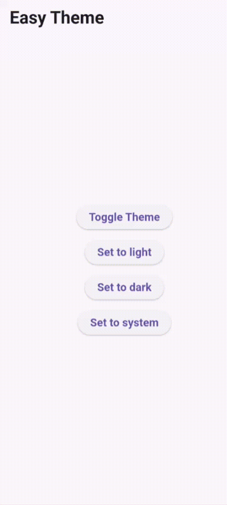
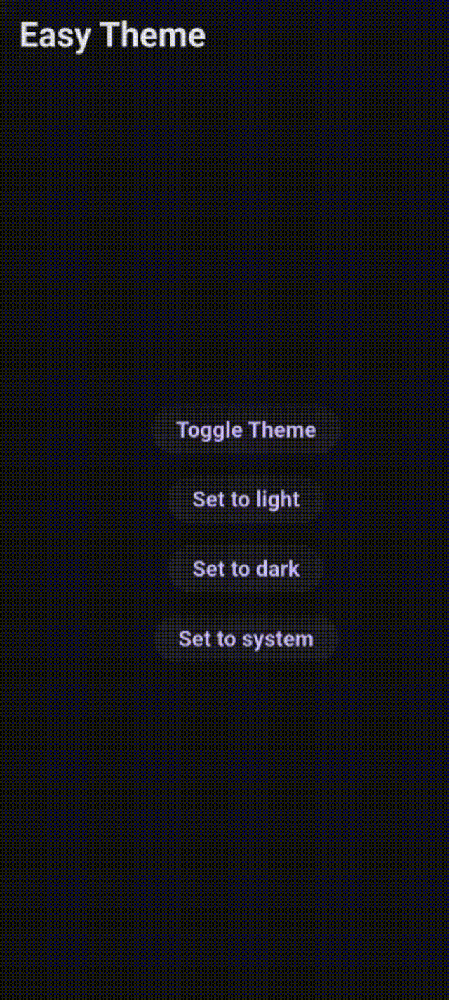

# Easy Theme

A powerful and easy-to-use theme management package for Flutter. It provides seamless theme
switching, persistence, and effortless access to theme states through `BuildContext` extensions.

## Demo

<p align="center">
  
  &nbsp;&nbsp;&nbsp;&nbsp;
  
</p>

## Features

- **Easy Switching**: Toggle between light, dark, and system themes with a single line of code.
- **Persistence**: Automatically saves and restores the user's theme preference.
- **Custom Storage**: Use the default `SharedPreferences` or provide your own storage implementation (e.g., Hive, Secure Storage).
- **BuildContext Extensions**: Access theme properties and methods directly from the `context`.

## Getting started

Add `flutter_easy_theme` to your `pubspec.yaml`:

```yaml
dependencies:
  flutter_easy_theme: ^1.1.0
```

## Initialization

Before using `EasyTheme`, you **must** initialize the package in your `main.dart` file. This ensures that the saved theme is loaded correctly before the app starts.

By default, `EasyTheme` uses `SharedPreferences` to persist the theme mode.

```dart
void main() async {
  // 1. Ensure Flutter bindings are initialized
  WidgetsFlutterBinding.ensureInitialized();

  // 2. Initialize EasyTheme and load the saved theme mode.(uses SharedPreferences by default)
  await EasyTheme.ensureInitialized();

  runApp(
    EasyTheme(
      // You can pass default Flutter themes
      lightTheme: ThemeData.light(),
      darkTheme: ThemeData.dark(),
      // OR your custom defined themes
      // lightTheme: AppThemes.light,
      // darkTheme: AppThemes.dark,
      child: const MyApp(),
    ),
  );
}
```

### Using Custom Storage

You can provide your own storage implementation by implementing the `EasyThemeStorage` interface and passing it to `ensureInitialized`.

```dart
class MyThemeStorage implements EasyThemeStorage {
  @override
  Future<void> saveThemeMode(ThemeMode mode) async {
    // Save to your preferred storage.
  }

  @override
  Future<ThemeMode?> loadThemeMode() async {
    // Load the saved theme mode from your storage.
    return null;
  }

  @override
  String get themeModeKey => 'theme_mode';
}

void main() async {
  WidgetsFlutterBinding.ensureInitialized();
  
  // Pass your custom storage here
  await EasyTheme.ensureInitialized(storage: MySecureStorage());

  runApp(
    EasyTheme(
      lightTheme: ThemeData.light(),
      darkTheme: ThemeData.dark(),
      child: const MyApp(),
    ),
  );
}
```

## Usage

### Setting up MaterialApp

To make the themes take effect, you **must** pass the theme properties from the `EasyTheme` context
to your `MaterialApp`.

```dart
class MyApp extends StatelessWidget {
  @override
  Widget build(BuildContext context) {
    return MaterialApp(
      // Access themes and mode via context extensions
      theme: context.lightTheme,
      darkTheme: context.darkTheme,
      themeMode: context.themeMode,
      home: const HomePage(),
    );
  }
}
```

### Important: Context Management

For `context.lightTheme`, `context.darkTheme`, and `context.themeMode` to be available, the
`MaterialApp` should **not** be a direct child of the `EasyTheme` widget in the same `build` method.

You have two options:

#### Option 1: Separate Widget (Recommended)

Extract your `MaterialApp` into a separate widget (as shown above) so it has its own `BuildContext`
that can look up the `EasyTheme` scope.

#### Option 2: Using a `Builder`

If you want to keep everything in one place, use a `Builder` widget to provide a new context.

```dart
void main() async {
  WidgetsFlutterBinding.ensureInitialized();
  await EasyTheme.ensureInitialized();

  runApp(
    EasyTheme(
      lightTheme: ThemeData.light(),
      darkTheme: ThemeData.dark(),
      child: Builder(
        builder: (context) {
          return MaterialApp(
            theme: context.lightTheme,
            darkTheme: context.darkTheme,
            themeMode: context.themeMode,
            home: const HomePage(),
          );
        },
      ),
    ),
  );
}
```

## BuildContext Extensions

`EasyTheme` provides convenient extensions on `BuildContext` to make theme management a breeze. They are divided into two categories:

### Reactive Watchers (Causes Rebuilds)

These extensions register a dependency on `EasyTheme`. When the theme changes, the widget using these properties will automatically rebuild.

- `context.themeMode`: Returns the current `ThemeMode` (light, dark, or system).
- `context.lightTheme`: Returns the provided light `ThemeData`.
- `context.darkTheme`: Returns the provided dark `ThemeData`.
- `context.isDark`: Returns `true` if the current effective theme is dark.
- `context.isLight`: Returns `true` if the current effective theme is light.
- `context.easyColor(lColor, dColor)`: Returns adaptive color based on the current theme.

### Non-Reactive Actions (No Rebuilds)

These extensions do **not** register a dependency. They are intended for use in callbacks (like `onPressed`) to avoid unnecessary rebuilds of the whole widget.

- `context.setThemeMode(ThemeMode mode)`: Sets a specific theme mode.
- `context.setThemeModeToLight()`: Switches to Light mode.
- `context.setThemeModeToDark()`: Switches to Dark mode.
- `context.setThemeModeToSystem()`: Switches to System mode.
- `context.toggleTheme()`: Toggles between Light and Dark modes.

### Adaptive Colors with `easyColor`

The `easyColor` method is useful for handling colors that aren't defined in your global `ThemeData`.
It allows you to define light and dark variations directly where they are needed.

```dart
class MyWidget extends StatelessWidget {
  const MyWidget({super.key});

  @override
  Widget build(BuildContext context) {
    return Container(
      color: context.easyColor(
        lColor: Colors.grey[200]!,
        dColor: Colors.grey[900]!,
      ),
      child: Text(
        'Adaptive Text',
        style: TextStyle(
          color: context.easyColor(
            lColor: Colors.black,
            dColor: Colors.white,
          ),
        ),
      ),
    );
  }
}
```

**Why use `easyColor`?**

- **Readability**: No more `if-else` or ternary operators checking the theme mode.
- **Conciseness**: Define adaptive colors in a single line.
- **Flexibility**: Perfect for custom UI elements that need specific color tuning.

## Important Notes

### `toggleTheme()` and System Mode

The `context.toggleTheme()` method is designed to switch between `ThemeMode.light` and
`ThemeMode.dark`.

**Note:** If the current `themeMode` is set to `ThemeMode.system`, calling `toggleTheme()` will have
**no effect**. You should first set the theme to a specific mode if you wish to use the toggle
functionality.

## Additional information

For a complete working example, please refer to
the [example folder](https://github.com/abdallahelnshar123-ux/easy_theme/tree/master/example).

Contributions and feedback are welcome.
